# Project Diagrams

### Diagram 1 — System Architecture
This diagram shows the high-level system architecture, depicting how the frontend, backend, database, and third-party AI providers interact.

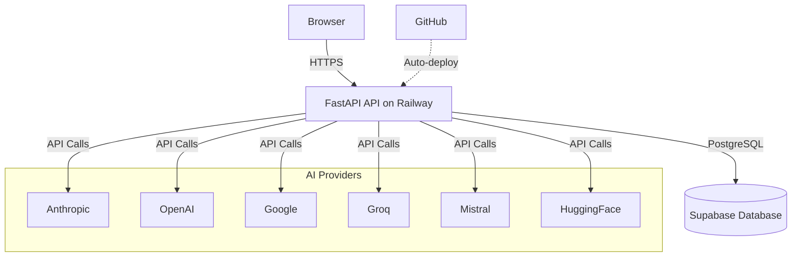

### Diagram 2 — Deployment Diagram
This diagram outlines the deployment strategy, moving from the developer's local environment through GitHub to the production environment on Railway and Supabase.

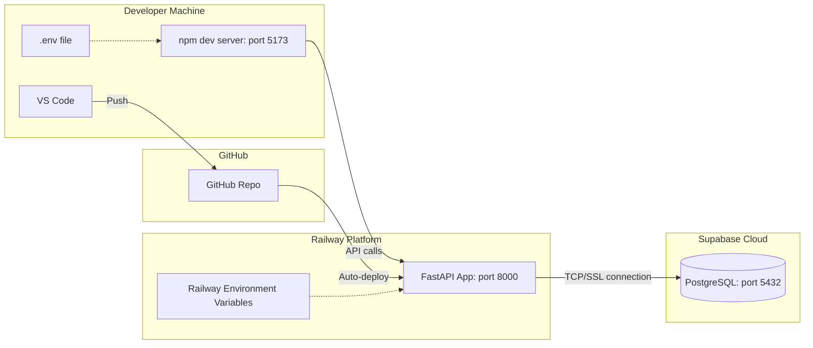

### Diagram 3 — Entity Relationship Diagram
This diagram describes the core database schema, outlining all 10 major tables, their key columns, and their cardinality.

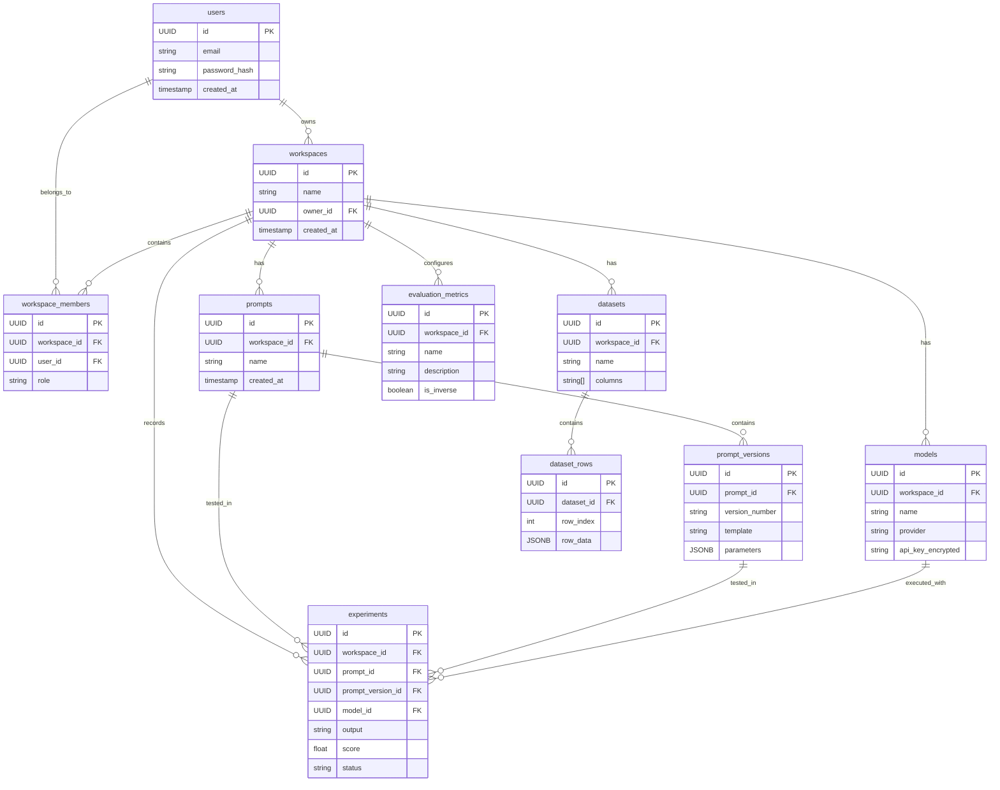

### Diagram 4 — Use Case Diagram
This diagram outlines the primary workflows available to an authenticated user within the prompt engineering platform.

```mermaid
graph TD
    User([Authenticated User])
    
    subgraph "Manage Models"
        AddMod[Add Model]
        EditMod[Edit Model]
        DelMod[Delete Model]
        ValMod[Validate API Key]
    end
    
    subgraph "Manage Prompts"
        CrePrm[Create Prompt]
        VerPrm[Version Prompt]
        SavPrm[Save Prompt]
        ComPrm[Commit Prompt]
    end
    
    subgraph "Run Inference"
        RunSgl[Single Run]
        RunBch[Batch Run]
    end
    
    subgraph "Manage Datasets"
        CreDat[Create Dataset]
        ImpDat[Import CSV/JSON]
        EdiDat[Edit Rows]
    end
    
    subgraph "Track Experiments"
        VwExp[View Experiments]
        FltExp[Filter Experiments]
        CmpExp[Compare Experiments]
        ExpExp[Export Experiments]
    end
    
    subgraph "Evaluate Outputs"
        ScrAI[Score with AI]
        CusMet[Custom Metrics]
        CmpBch[Compare Batches]
    end
    
    subgraph "Manage Settings"
        WsNam[Workspace Name]
        CusSet[Custom Metrics Settings]
        PrfSet[Profile Settings]
    end

    User --> AddMod
    User --> EditMod
    User --> DelMod
    User --> ValMod

    User --> CrePrm
    User --> VerPrm
    User --> SavPrm
    User --> ComPrm

    User --> RunSgl
    User --> RunBch

    User --> CreDat
    User --> ImpDat
    User --> EdiDat

    User --> VwExp
    User --> FltExp
    User --> CmpExp
    User --> ExpExp

    User --> ScrAI
    User --> CusMet
    User --> CmpBch

    User --> WsNam
    User --> CusSet
    User --> PrfSet
```

### Diagram 5 — Sequence Diagram: Inference Flow
This sequence diagram walks through the process of running a single inference call from the browser through the API to the external AI provider.

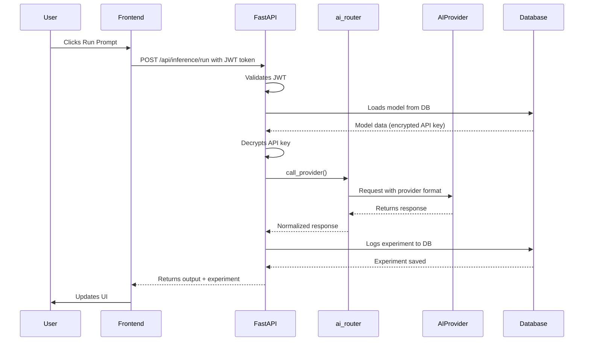

### Diagram 6 — Sequence Diagram: Auth Flow
This diagram illustrates the user registration and login flows, including workspace and default metric creation during signup, and the protected route authentication mechanism.

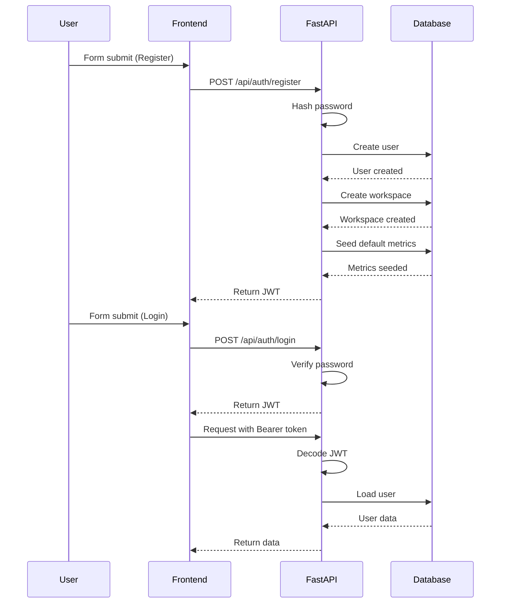

### Diagram 7 — Sequence Diagram: Batch AI Scoring
This diagram models the asynchronous workflow of scoring a batch of experiments using an AI background task with frontend polling.

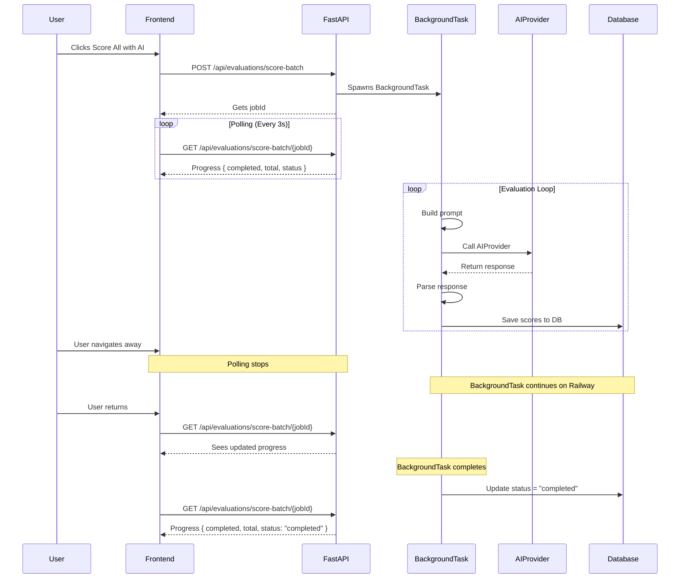

### Diagram 8 — Activity Diagram: Prompt Lifecycle
This diagram visualizes the states a prompt traverses throughout its lifetime, distinguishing between autosaving drafts and explicitly committing new versions.

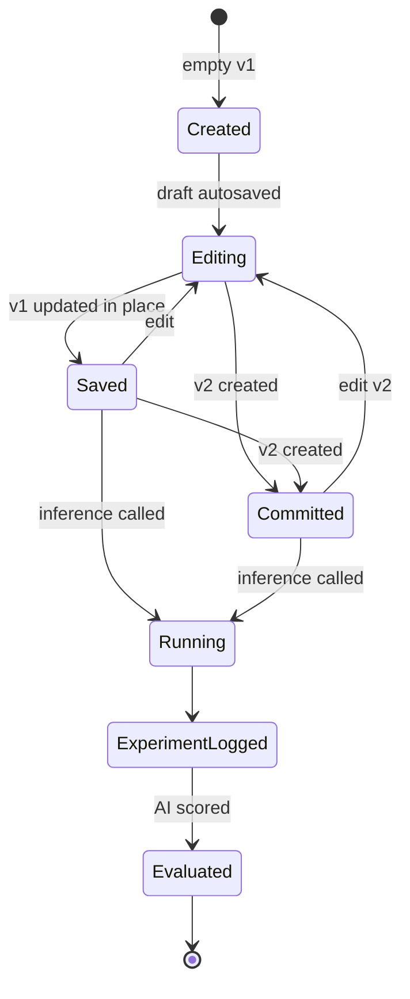

### Diagram 9 — State Diagram: Experiment
This diagram shows how experiments transition from running through to being fully scored, including edge cases like partial scoring or rescoring.

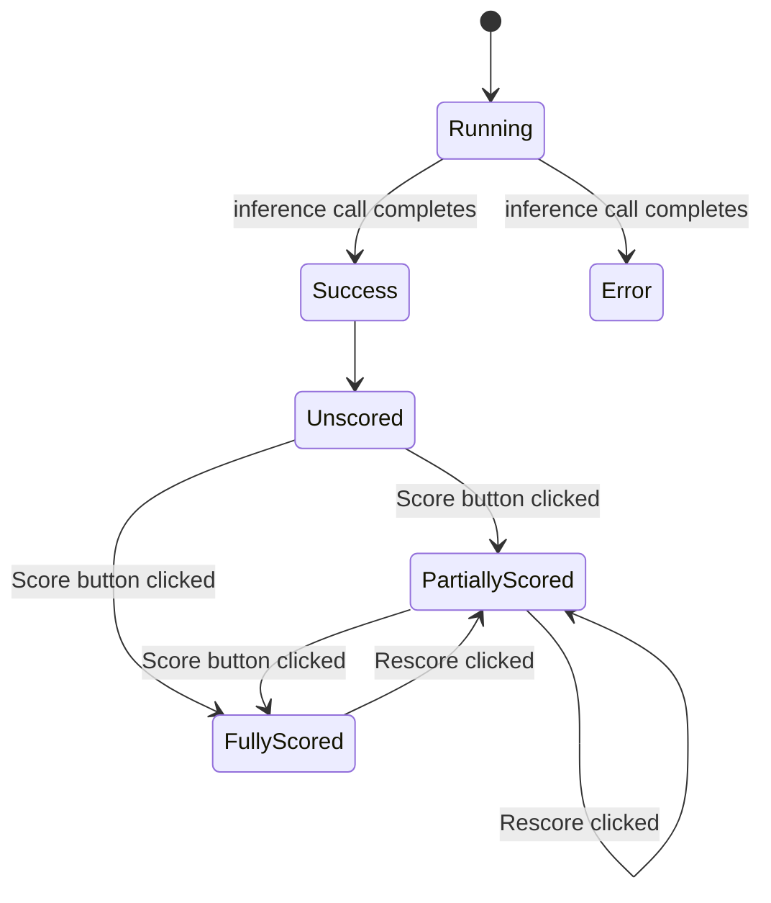

### Diagram 10 — API Endpoint Map
This diagram maps out the structure of the FastAPI application by logically grouping endpoints under their respective router subgraphs.

```mermaid
graph TD
    subgraph "Auth"
        A_Reg[/register]
        A_Log[/login]
        A_Me[GET /me]
        A_MeP[PATCH /me]
    end

    subgraph "Models"
        M_CRUD[GET/POST/PATCH/DELETE]
        M_Val[/validate]
    end

    subgraph "Prompts"
        P_CRUD[GET/POST/PATCH/DELETE]
        P_Dup[/duplicate]
        P_Ver[GET/POST/PATCH /versions]
    end

    subgraph "Datasets"
        D_CRUD[GET/POST/PUT/DELETE]
        D_Imp[/import]
    end

    subgraph "Experiments"
        E_CRUD[GET/POST/PATCH/DELETE]
        E_Bulk[/bulk-delete]
        E_Batch[GET/PATCH /batches]
    end

    subgraph "Inference"
        I_Run[/run]
    end

    subgraph "Evaluations"
        Ev_Sco[/score]
        Ev_ScoB_P[POST /score-batch]
        Ev_ScoB_G[GET /score-batch]
        Ev_ScoB_C[POST /score-batch/cancel]
        Ev_BchR[/batch-run]
    end

    subgraph "Metrics"
        Met_CRUD[GET/POST/PATCH/DELETE]
    end
```

### Diagram 11 — Security Architecture
This diagram traces the flow of sensitive data, demonstrating how API keys are encrypted at rest and dynamically decrypted for inference without ever leaving the server.

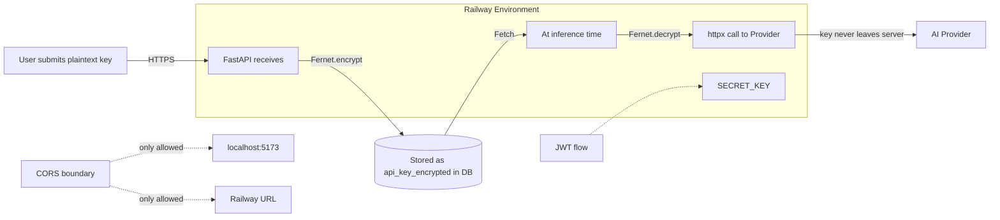

### Diagram 12 — Frontend Page Navigation
This diagram provides a sitemap of the React frontend application, illustrating exactly how a user navigates between the various views.

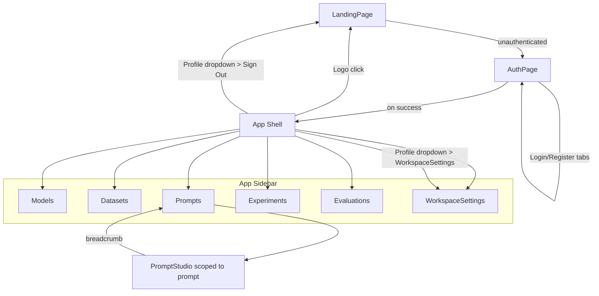

### Diagram 13 — Component Diagram: Backend
This diagram maps out the internal dependencies inside the backend, showing how FastAPI routers depend on utility services and data models.

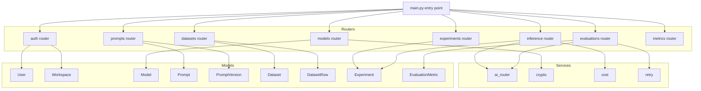

### Diagram 14 — Data Flow Diagram Level 1
This high-level data flow diagram defines the exchange of entities between the major architectural processes and the underlying data stores.

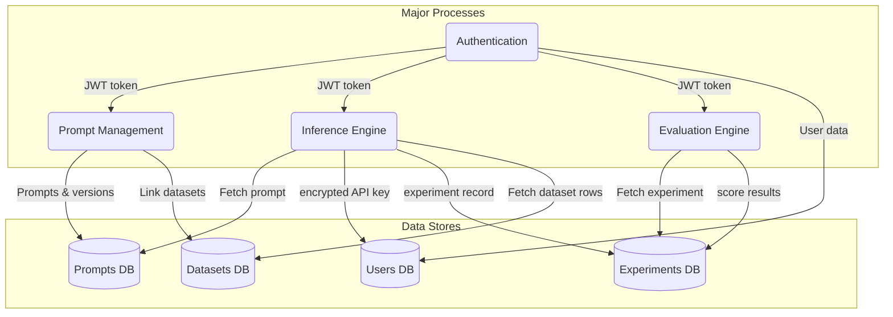
